# Whack A Mole

Whack A Mole Revamped, a simple clicker game created in Javascript. A slight spin off from the original Whack A Mole, more of a Whack A Plumber.

General concept of the game, is to click the plumbers as they pop up on the screen with your trustee Hammer themed mouse cursor. The game has a timer, some controls as well as a score.

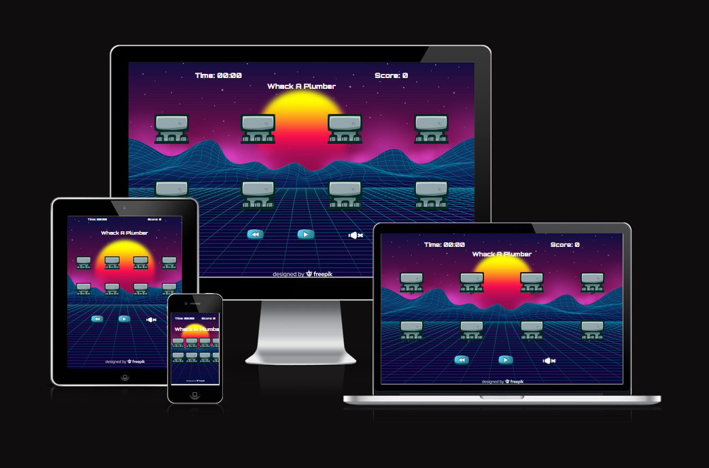

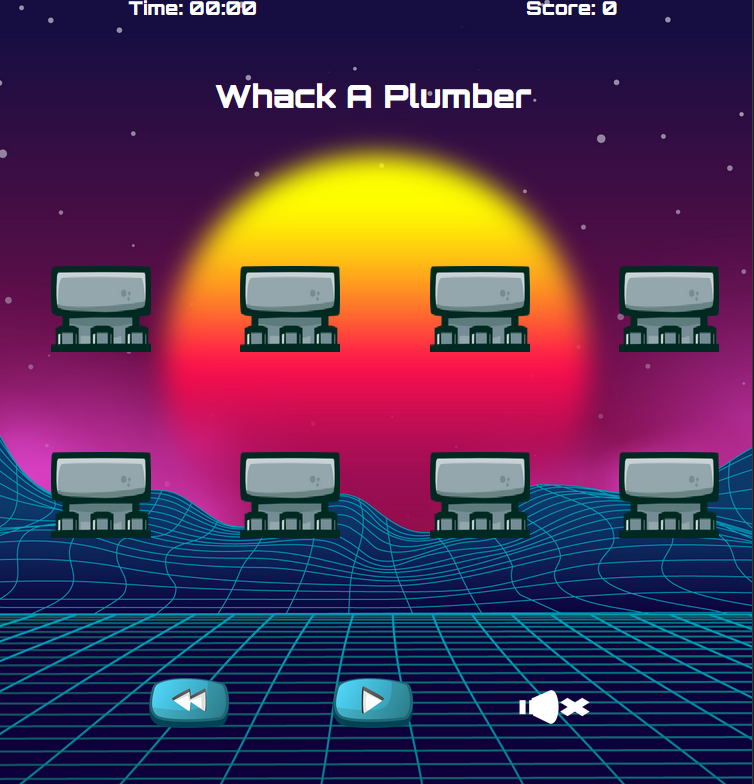

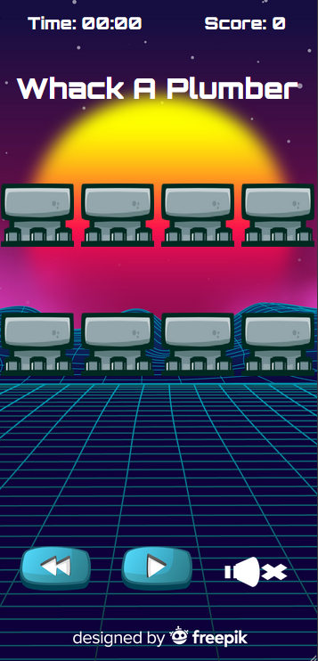

## Design and Wireframes

- __Desktop WireFrame__

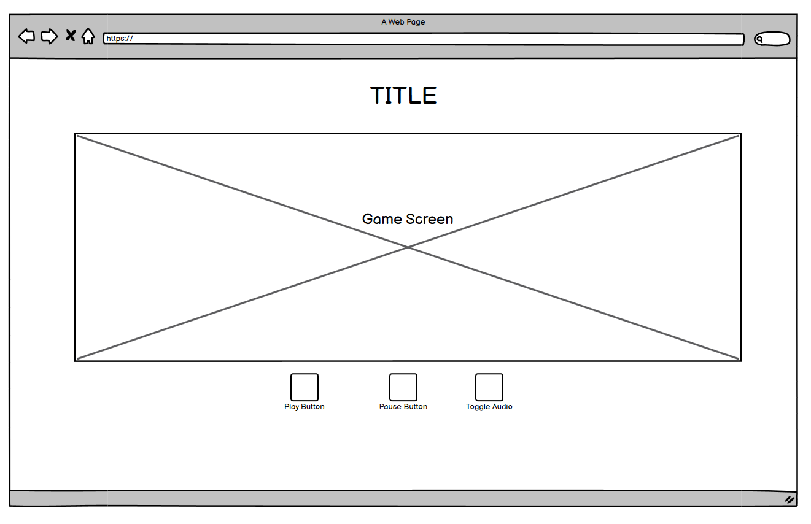

 

- __Tablet WireFrame__

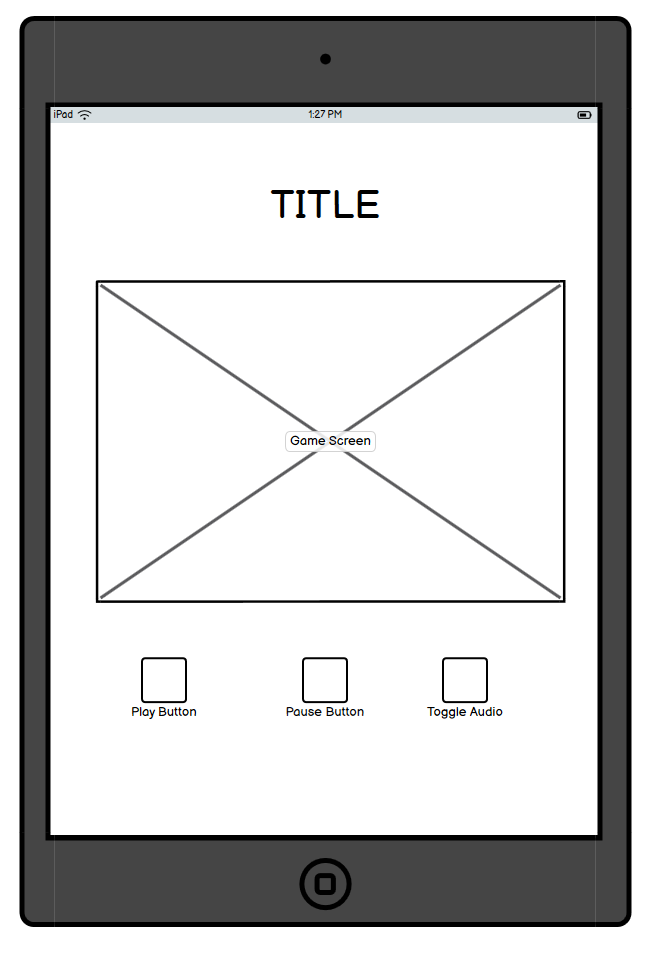

 

- __Mobile WireFrame__

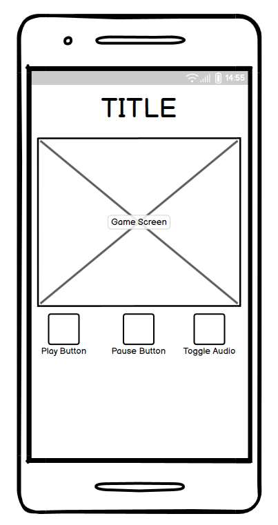

 

## Features 

The revamped version of whack a mole will contain a moderately sized game screen where the main game will be played and displayed. There will also be various buttons around the game screen such as play, pause and audio options.

### Existing Features

- __Game Screen__

  - The game screen is the main attraction and houses the game itself. This area is the primary function and most interactive portion of the website. 

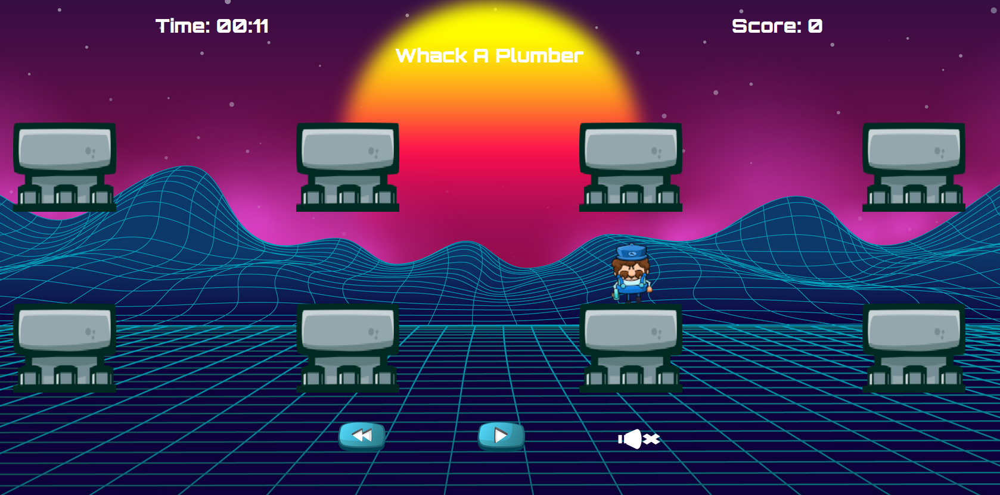

- __Game Controls__

  - Game controls, this feature allows the user control of starting, pausing, restarting and changing the game settings.

- __Gameplay Elements__

  - The player is equipped with a hammer, which is then used to whack the plumbers back into their pipes. By doing so this increases their score with every hit.
  - A retro 8-bit funk audio track can be played as well, this is toggled by the speaker icon, by default the audio is muted.

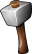

### Features Left to Implement

- Additional/Multiple Levels
- Scoreboard

### Project Board

- Github projects was utilised for the agile and project management aspects of this mini project.

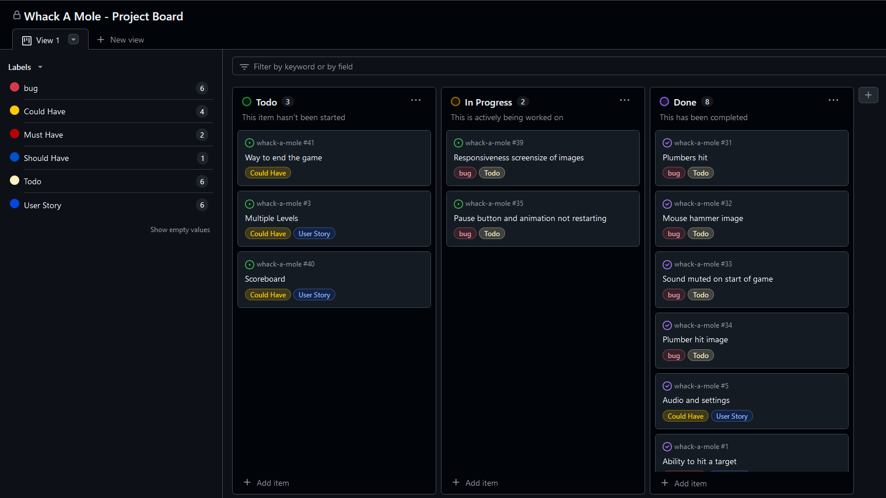

## Testing 

Testing was and is an ongoing process, this is primarily done due the development process. Typically one developer preferred chrome and the other firefox, this unintended method of work enabled us to catch some interesting errors before the game would reach any potential users. E.g. Chrome by default doesn't autoplay sound, where as firefox does. Originally music was to autoplay upon loading the site, chrome unintentionally broken this feature so a rework was required, this was fixed by using the play button for the game to also start the music. Chrome initially required user interaction on the page and autoplay settings to be enabled by the client, by starting the audio when the game is pressed resolved the issue and would then be part of the general gameplay loop regardless.

### Validator Testing 

- HTML
  - No errors were returned when passing through the official HTML Validator.

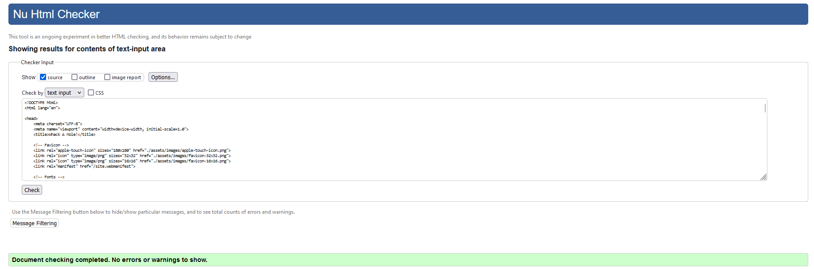

- CSS
  - 2 errors were found when passing through the official CSS Validator.
  - The errors mentioned can be justified by the following links [MDN](https://developer.mozilla.org/en-US/docs/Web/CSS/font-optical-sizing), [Google Fonts](https://fonts.google.com/share?selection.family=Orbitron:wght@400..900).

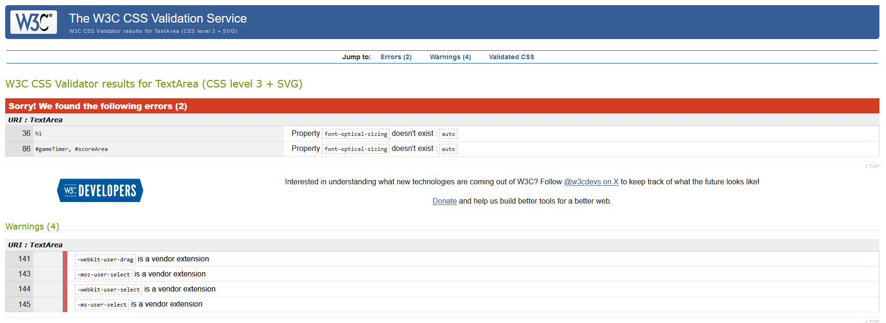

- The images below show how the errors in our CSS code were given via the google fonts links, also the MDN image backs up that the code should be valid.

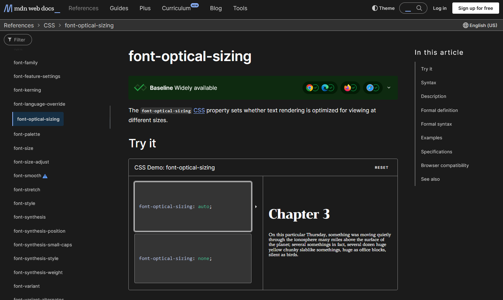
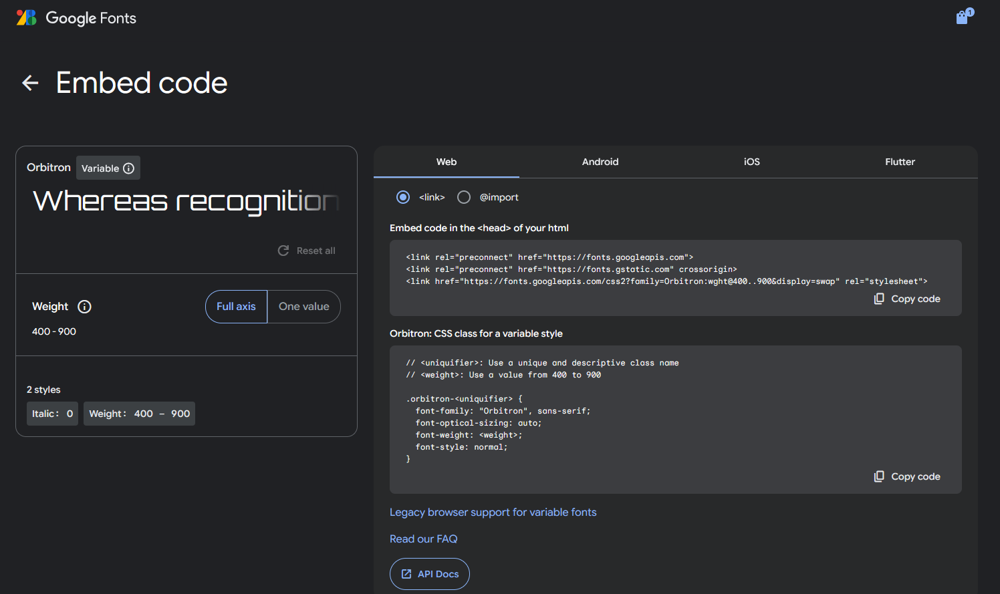

### Unfixed Bugs

You will need to mention unfixed bugs and why they were not fixed. This section should include shortcomings of the frameworks or technologies used. Although time can be a big variable to consider, paucity of time and difficulty understanding implementation is not a valid reason to leave bugs unfixed. 

## Deployment

For this project, GitHub Pages was used as the deployment method. GitHub pages allows frontend only applications to be hosted, therefore is suited out project perfectly.

- The site was deployed to GitHub pages. The steps to deploy are as follows: 
  - In the GitHub repository, navigate to the Settings tab 
  - From the source section drop-down menu, select the Master Branch
  - Once the master branch has been selected, the page will be automatically refreshed with a detailed ribbon display to indicate the successful deployment. 

The live link can be found here - https://nsj021.github.io/whack-a-mole/ 

## Credits 

Coding Credits, this project was created and contributed too by two developers.
[Nathan Jones](https://github.com/NSJ021),
[Rob Beach](https://github.com/surfdemon)

Contributions were distributed approximately 50% 50% with regard to project progress and coding.

### Content 

- Content used on this page is primarily images that are referenced below, [Google Fonts](https://fonts.google.com/)

### Media

- Most images are from owned or purchased sources, [Game Developer Studio](https://www.gamedeveloperstudio.com/)
- [Freepik](https://www.freepik.com/) was used for some images, primarily backgrounds.

## Summary

The primary goal of this project was to practice working as a team as well as using agile principles. The general idea was to remake a game, whack a mole was chosen as the game.
This project was worked on for 4-5 days, from start to MVP.